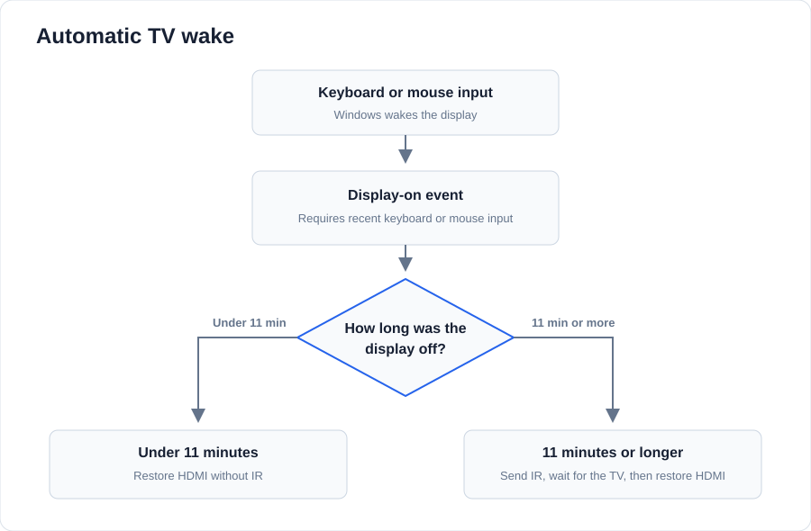

# tcl-ir

Turns a TCL TV on when Windows wakes its display from keyboard or mouse input.
It uses an Ocrustar/ElkSmart USB IR blaster and then restores the HDMI display
path.



## Requirements

- Windows 11
- Python 3.10+
- Ocrustar/ElkSmart USB IR blaster, VID `045C`, PID `0195`
- TCL TV compatible with the included 24-bit RCA codes

Purchase links: [AliExpress EKX4S-T](https://www.aliexpress.com/item/1005005825447410.html)
or [eBay EKX4S-T listings](https://www.ebay.com/sch/i.html?_nkw=Ocrustar+EKX4S-T).
Confirm VID `045C` and PID `0195`; other revisions use different protocols.

## Install

```powershell
git clone https://github.com/jdt1/tcl-ir.git
cd tcl-ir
py -m venv .venv
& .\.venv\Scripts\Activate.ps1
python -m pip install -r requirements.txt
python -m unittest discover -s tests -v
```

Bind the IR dongle to **WinUSB** with
[Zadig](https://zadig.akeo.ie/). Select only the `SMART` / `045C:0195` device.

This dongle may also need the following workaround in an elevated PowerShell:

```powershell
New-Item -Path 'HKLM:\SYSTEM\CurrentControlSet\Control\usbflags\045C01950200' -Force | Out-Null
New-ItemProperty -Path 'HKLM:\SYSTEM\CurrentControlSet\Control\usbflags\045C01950200' `
  -Name SkipBOSDescriptorQuery -PropertyType DWord -Value 1 -Force | Out-Null
```

Unplug and reconnect the dongle, then verify it:

```powershell
python .\src\ir_probe.py --pid 0x0195 --handshake
python .\tv.py vol-
```

The probe should identify a D552 device with signature `7001`. The Volume Down
command is a safe way to confirm that the dongle is aimed correctly.

## Automatic wake

Install the scheduled task from an elevated PowerShell. The default is a dry
run: display recovery is active, but IR transmission is disabled.

```powershell
& .\tools\install_wake_monitor.ps1
Get-Content "$env:LOCALAPPDATA\tcl-ir\wake-monitor.log" -Wait
```

After checking a complete display-off and wake cycle, enable IR:

```powershell
& .\tools\install_wake_monitor.ps1 -Enable
```

The task starts at interactive logon and survives reboots. To remove it:

```powershell
& .\tools\uninstall_wake_monitor.ps1
```

## Behavior

- Listens for Windows display power events; it does not poll or record input.
- Requires recent keyboard or mouse input after a display-off period.
- For 10 minutes after display-off, it restores HDMI without IR.
- Ten seconds after the TV's standby timeout, it may send IR power.
- Sends at most one power command per display-off cycle.
- Restores the Windows display and restarts only the TCL monitor device if the
  HDMI path remains inactive.

## Manual control

```powershell
python .\tv.py --list
python .\tv.py vol+
python .\tv.py vol- --repeat 3
python .\tv.py power
```

The core commands use timings captured from the Ocrustar TV-TCL 3407 profile.
Additional commands printed by `--list` are marked as candidates.

## Troubleshooting

- If the dongle is missing or the handshake times out, unplug and reconnect it.
- USB acknowledgement `FF FF FF FF` confirms transmission by the dongle, not
  reception by the TV. Check aim and line of sight.
- Logs are stored at `%LOCALAPPDATA%\tcl-ir\wake-monitor.log`.

Protocol attribution is documented in
[THIRD_PARTY_NOTICES.md](THIRD_PARTY_NOTICES.md).

## License

[MIT](LICENSE)
